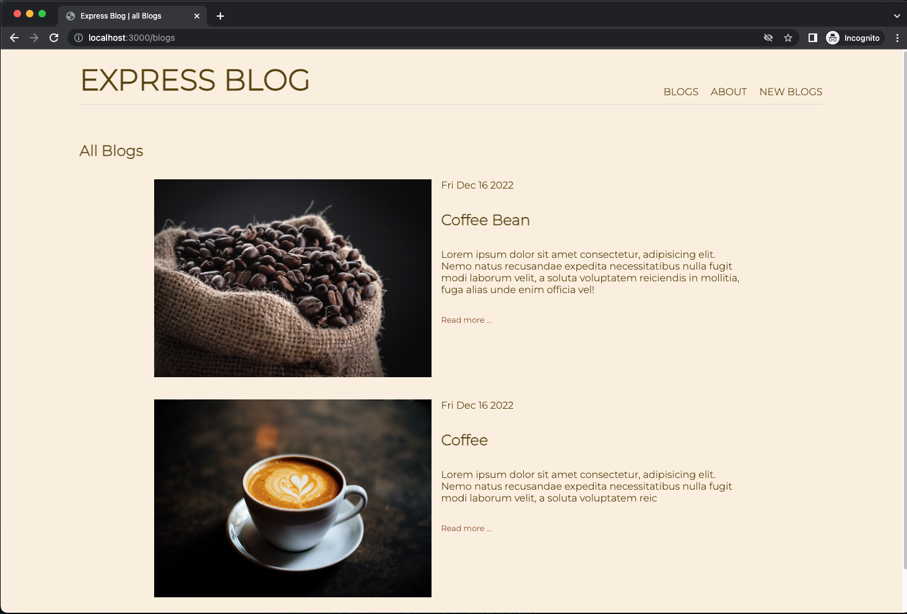
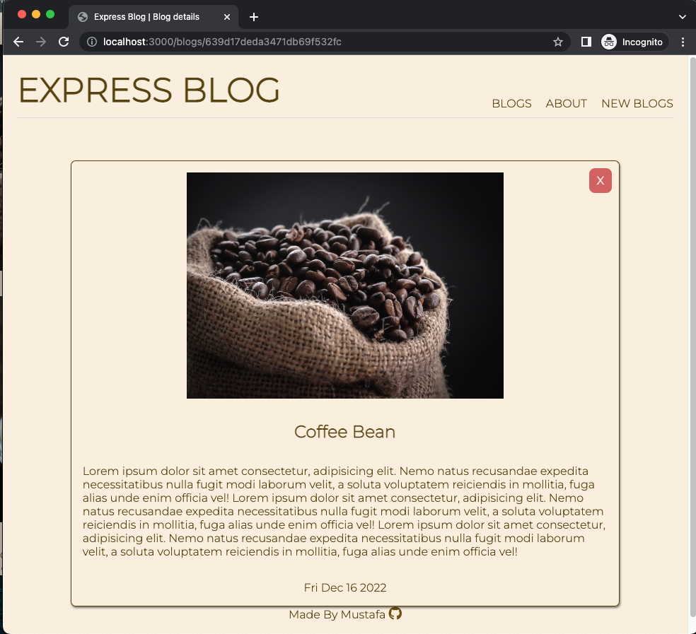
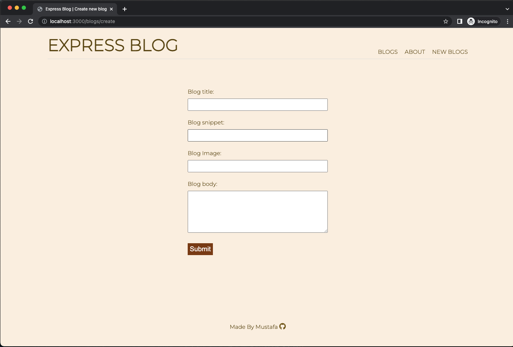

## EXPRESS BLOG

This Blog website was built as a part of The Odin Project Node.js course , and it allows users to create, view, edit and delete blogs using the following technologies :

- Node.js and Express to build the backend server
- EJS for the Template engine
- MongoDb for the database
- Mongoose as modeling tool for MongoDB

### Live

👉 https://blog-mongodb.onrender.com/blogs

